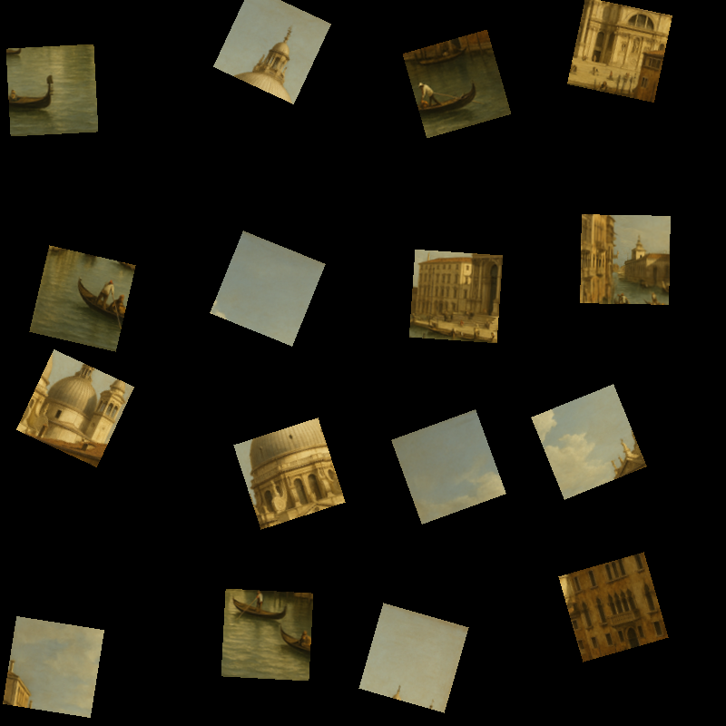

# Jigsaw Puzzle Solver

A Java/Swing application that automatically reassembles a scrambled jigsaw puzzle image. Given an image containing scattered puzzle pieces (rotated and/or translated), it detects the individual pieces, figures out how they fit together by comparing edge pixels, and animates the reconstruction of the original image.

Built for the Multimedia Systems Design course (USC).

## Demo

### `images/test_regular_rotate.png` (rotated pieces)

<table>
<tr>
<td></td>
<td></td>
</tr>
<tr>
<td align="center">Scrambled</td>
<td align="center">Solved</td>
</tr>
</table>


### `images/test_regular_translate.png` (scattered, unrotated pieces)

<table>
<tr>
<td></td>
<td></td>
</tr>
<tr>
<td align="center">Scrambled</td>
<td align="center">Solved</td>
</tr>
</table>


## How it works

1. **Piece extraction** (`PieceExtractor`) — pieces are located either as connected foreground components (irregular puzzles) or by tiling the image into a uniform grid as a fallback (`tileImage`).
2. **Rotation correction** (`Piece.detectAndCorrectRotation`) — each piece's rotation angle is detected and the piece is de-rotated and tightly cropped so edges line up cleanly.
3. **Edge feature extraction** (`EdgeFeature`, `OrientedPiece`) — a strip of pixels along each of the 4 sides of a piece is sampled to build a comparable "edge signature," for all 4 rotations of a piece.
4. **Assembly** (`PuzzleAssembler`) — pieces are placed into a grid by greedily matching edges using Mean Squared Error (MSE) between edge signatures; regular-grid and irregular-layout solving are handled separately.
5. **Animation** (`AnimationWindow` / `AnimationPanel`) — a Swing window animates each piece flying from its scrambled position/rotation into its solved position.

See [SOLUTION.md](SOLUTION.md) for notes on a specific bug (translate-puzzle edge corruption from unnecessary rotation correction) and its fix.

## Requirements

- JDK 8+ (uses `javax.swing`, `javax.imageio`, no external dependencies)

## Build & run

```bash
javac PuzzleSolver.java
java PuzzleSolver [path/to/image.png]
```

If no path is given, it defaults to `images/test2.png`. Sample puzzle images (regular/irregular, rotated/translated variants, plus `MonaLisa` and `StarryNight` puzzles) are included in [images/](images/).

The solver has a 10-minute timeout and prints progress (detected rotation per piece, remaining time) to the console while solving, then opens an animation window showing the pieces assembling into the final image.

## Configuration

Key tunables live as constants at the top of `PuzzleSolver.java`:

| Constant | Purpose |
|---|---|
| `GRID_ROWS` / `GRID_COLS` | Fallback grid size when too few components are detected |
| `FOREGROUND_THRESHOLD` | Threshold for separating puzzle pieces from background |
| `MIN_COMPONENT_SIZE` | Minimum pixel area to count as a real piece |
| `USE_IRREGULAR_SOLVER` | Toggle irregular-shape vs. grid-based assembly |
| `EDGE_WIDTH` / `EDGE_SAMPLE_DEPTH` | How much of each edge is sampled for matching |
| `ANIMATION_FRAMES` / `ANIMATION_FPS` | Solve animation timing |

## Project structure

```
PuzzleSolver.java     # Entire application (extraction, solving, animation)
SOLUTION.md           # Debugging notes for a translate-puzzle rotation bug
images/               # Sample scrambled puzzle images used as test input
scripts/RenderDemo.java  # Headless renderer used to generate the demo images/GIF above
docs/demo/            # Demo screenshots and animation shown in this README
```
